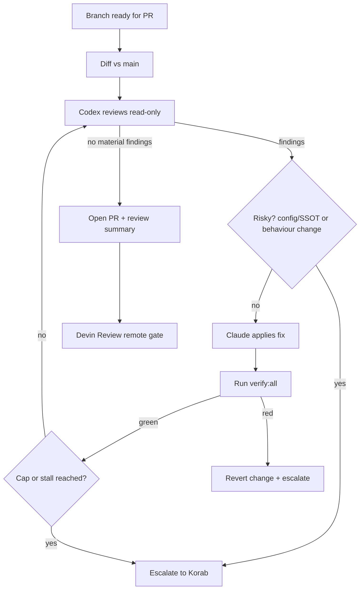

# Headless Codex Review Loop

## Summary

A headless codex review loop that runs at PR time: codex reviews the branch diff against `main` for bugs, quality, and simplification opportunities; Claude applies the fixes; codex re-reviews; and this repeats unattended until the diff is clean or the loop hits something risky. Codex only reviews and never edits code it will later grade, so it stays an independent second opinion. The branch is already improved by the time the PR opens, and Devin still reviews remotely as it does today.

---

## Problem Frame

Today, changes to korabeland.com get two automated safety layers: `verify:all` locally (Biome, `tsc`, Vitest, Playwright, Lighthouse) and Devin Review remotely, which gates every PR. Both are useful, but both are checks: `verify:all` proves the code runs, and Devin flags issues at PR time. Neither one actively improves the code, and neither gives a second-model opinion before the change reaches the PR.

That leaves a gap for a solo workflow where Claude writes most of the code. Claude's output can carry avoidable bugs and, more often, unnecessary complexity that a fresh reviewer would catch and simplify. The current options are for Korab to catch these by hand, or to wait for Devin at PR time (remote, late, and gate-only, so it flags rather than fixes). The cost is either Korab's review time or complexity that quietly ships.

---

## Actors

- A1. Korab: repo owner. Opens PRs, receives escalations, is the final approver on anything risky.
- A2. Claude (main loop): orchestrates the review loop, applies codex's findings, runs `verify:all`, opens the PR.
- A3. Codex (headless reviewer): reviews the branch diff read-only and returns findings (bugs, quality, simplifications). Never edits code.
- A4. `verify:all` suite: the local quality gate that must stay green across the loop.
- A5. Devin Review: the existing remote PR gate. Unchanged, and runs after the loop opens the PR.

---

## Key Flows

- F1. PR-time review loop
  - **Trigger:** a branch is complete and about to become a PR.
  - **Actors:** A2, A3, A4
  - **Steps:** compute diff vs `main`, codex reviews read-only, Claude applies non-risky findings, re-run `verify:all`, fresh codex pass re-reviews, repeat.
  - **Outcome:** branch is codex-clean and `verify:all`-green, PR opens with a review summary. Or the loop escalates.
  - **Covered by:** R1, R2, R3, R4, R5, R6, R7, R11

- F2. Escalation / abort path
  - **Trigger:** codex flags a change to a protected or single-source-of-truth file, a behaviour-changing edit, `verify:all` cannot be made green, or the iteration cap / oscillation is hit.
  - **Actors:** A2, A1
  - **Steps:** loop pauses, Claude surfaces the specific finding plus current state to Korab, Korab decides (apply by hand, skip, adjust), loop resumes or aborts.
  - **Outcome:** no risky change lands unattended, Korab holds the decision.
  - **Covered by:** R8, R9, R10

---

## Requirements

**Trigger and scope**
- R1. The loop runs at PR-creation time against the branch diff vs `main` (the same diff Devin later reviews). It does not fire per-commit or continuously.
- R2. The loop reviews the whole cohesive branch change as a unit, not individual commits.

**Codex review role**
- R3. Codex reviews the diff read-only and returns findings in three categories: bugs and correctness, quality, and simplification opportunities. Codex never edits code it will later re-review.
- R4. Each loop pass uses a fresh codex invocation so re-review is not biased by the prior pass's context.

**Apply and converge**
- R5. Claude applies codex's findings. Codex does not write code.
- R6. After each apply, the loop re-runs the full test/verify suite (`verify:all`) and only continues when it is green.
- R7. The loop iterates review, apply, verify, re-review until codex returns no material findings, then opens the PR with a summary of what changed and why.

**Safety and escalation**
- R8. Changes to orchestrator-only / single-source-of-truth files (per `AGENTS.md` §3, for example `astro.config.mjs`, `package.json`, `keystatic.config.ts`, `src/lib/status.ts`) and behaviour-changing edits are escalated to Korab instead of being auto-applied.
- R9. If `verify:all` cannot be made green after applying a finding, that change is reverted and the finding is escalated rather than shipped.
- R10. The loop has a max-iteration cap plus oscillation/stall detection. On hitting either, it stops and hands the current state to Korab rather than churning.

**Output and integration**
- R11. A dated review summary is written to the existing `docs/reviews/` convention, and codex-driven fixes land as a distinct, clearly labelled commit so the PR diff stays legible.
- R12. The loop is advisory-by-construction and local. It does not become a required CI status check, and Devin Review remains the enforced remote gate, running unchanged after the PR opens.

**Packaging and enforcement**
- R13. The loop is packaged as a reusable skill that holds its logic (review, apply, verify, re-review, escalate). A Claude Code hook enforces that the skill runs before any PR is opened, so no change reaches a PR without a codex pass.

---

## Acceptance Examples

- AE1. **Covers R6, R9.** Given codex flags a simplification, when Claude applies it and `verify:all` then fails, the change is reverted and the finding is escalated to Korab rather than shipped.
- AE2. **Covers R8.** Given a codex finding would edit `src/lib/status.ts` or `astro.config.mjs`, when the loop reaches that finding, it escalates to Korab instead of auto-applying.
- AE3. **Covers R7, R10.** Given codex keeps returning findings, when the iteration cap is reached without convergence, the loop stops and hands the current state to Korab instead of looping further.
- AE4. **Covers R3, R7.** Given codex returns no material findings on the first pass, when the loop runs, it opens the PR immediately with a clean summary and no code changes.

---

## Success Criteria

- PRs open already simplified and bug-checked, so Korab and Devin spend less time on issues codex could have caught earlier.
- No risky change (config, SSOT, or behaviour-altering) ever lands unattended. Korab always sees those before they ship.
- A downstream implementer can build the loop from this doc without inventing the trigger point, autonomy level, who-edits split, the verify gate, or the escalation boundary.
- Over time, branches that pass through the loop draw fewer Devin findings and fewer post-merge fixups.

---

## Scope Boundaries

- Not a per-commit or continuous-watcher trigger. Per-PR only.
- Not report-only, and not codex-writes-its-own-fixes. Auto-apply with Claude as author is the chosen shape.
- Not a required CI check, and not a replacement for Devin Review or `verify:all`. It layers before them.
- Not multi-repo or global. Scoped to korabeland.com.
- Not run in CI or the cloud. Local, pre-PR only. CI auth and cost are out of scope for this version.

---

## Key Decisions

- Per-PR trigger: reviews cohesive units and sits just ahead of Devin on the same diff, avoiding per-commit noise and continuous-watcher infrastructure.
- Fully headless auto-apply: the loop converges the code unattended. The human gate is the PR itself plus escalations, not mid-loop approval.
- Claude applies, codex reviews only: preserves codex as an independent second opinion, accepting more orchestration than letting codex edit its own findings.
- `verify:all` inside the loop: the guard that makes headless auto-apply safe. A red suite blocks convergence.
- Advisory and local, not a CI gate: Devin stays the enforced check, which keeps this layer fast and low-friction.
- Skill + hook wiring: the loop lives in a reusable, testable skill, and a hook enforces it fires before every PR, so coverage does not depend on remembering to run a ship flow.

---

## Dependencies / Assumptions

- Codex CLI is installed and authenticated. Verified: `codex-cli 0.142.5` at `/opt/homebrew/bin/codex`.
- A stable base branch (`main`) exists to diff against. Verified.
- `codex review` gives a signal clean enough to drive both apply and a convergence check (no material findings). Assumption, validate in planning.
- `verify:all` is reliable and fast enough to run repeatedly per PR without making PR creation painful. Assumption.
- Codex API cost and latency across multiple passes per PR are acceptable. Assumption.

---

## Outstanding Questions

### Deferred to Planning

- [Affects R3, R7][Needs research] Does `codex review` emit a clean machine-readable convergence signal, or does the loop need to parse and classify its output to decide "no material findings"?
- [Affects R6][Technical] Run full `verify:all` every pass, or a faster subset mid-loop (`verify` + `test`) with a full `verify:all` once at the end, to bound cost and latency?
- [Affects R10][Technical] What iteration cap, and what precisely counts as oscillation/stall?
- [Affects R11][Technical] Commit strategy for codex-driven fixes: one squashed "codex pass" commit, per-pass commits, or amend.
