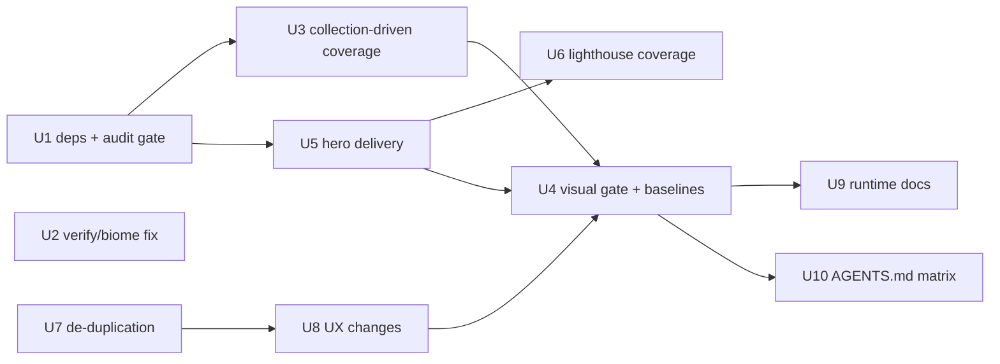

# fix: Site Health Remediation and Recurrence Prevention

## Summary

Remediate the 2026-07-10 audit findings in ten dependency-ordered units: patch runtime dependencies in-range and add a blocking CI security audit; fix the Biome nested-root failure that breaks `pnpm verify` from the main checkout; derive route/SEO/axe/visual/performance coverage from the Keystatic collections instead of hardcoded lists; replace the 9.7 MB PersonalOS hero with dimensioned responsive delivery under a 200 KB budget; extend Lighthouse coverage to the PersonalOS article and a mobile profile; make Chromatic the single blocking visual gate with freshly verified baselines; extract the duplicated ledger and portrait patterns and add a shift-precedence parity test; land the two approved UX changes (provenance label, 3 featured case studies); and reconcile runtime docs plus add the AGENTS.md change-trigger matrix. Owner-approved gate decisions: blocking Chromatic, 200 KB above-fold image budget, 3 featured case studies, Node 22 canonical, no automated dependency PRs (blocking audit only, per origin Assumption 3).

---

## Problem Frame

The full-site audit found the release path untrustworthy: high-severity production vulnerabilities, a verify command that fails in the normal multi-worktree environment, a visual gate that never blocks, and coverage that silently lags the content collections. Full evidence table in the origin doc (see Sources & References).

Two premise corrections from research, folded into scope:

- The metric-provenance disclosure is **already** a keyboard-accessible native `<details>/<summary>` with a no-JS fallback (`src/components/CaseStudy/OutcomeMetrics.astro`, covered by `tests/e2e/provenance.spec.ts`). The real gap is only a self-describing "How this was measured" accessible label.
- The ledger and portrait "duplication" is hand-rolled markup+CSS repeated across page files (`src/pages/index.astro`, `src/pages/work/index.astro`, `src/pages/about.astro`), not a shared component configured two ways. The same unsized-eager-hero anti-pattern exists in **both** `src/components/ReadingRoom/index.astro` and `src/components/CaseStudy/index.astro`.

---

## Requirements

Traced to the origin doc's six Required behaviour sections:

- R1. Runtime dependencies patched for all high/critical `pnpm audit --prod` findings; CI runs `pnpm audit --prod --audit-level=high` as a distinct blocking step, not confusable with the Lighthouse `pnpm run audit` script. Unremediable high/critical findings require a documented risk exception.
- R2. `pnpm verify` passes from a checkout containing `.claude/worktrees/` without reducing what it checks; one authoritative, documented visual approval mechanism (blocking Chromatic — owner-approved); a PR altering a covered page cannot silently bypass the gate; current visual failures resolved by review, never by deleting baselines.
- R3. Post/case-study heroes reserve their aspect ratio with intrinsic dimensions; hero delivery is responsive (no full-resolution default to a 620 px column or mobile); the PersonalOS hero is no longer served as the 9.7 MB PNG; Lighthouse covers the PersonalOS article and a mobile profile with LCP ≤ 2.5 s / CLS ≤ 0.1; the 200 KB delivered-variant budget is documented and mechanically checked.
- R4. Every published project gets route + metadata/SEO + serious/critical axe coverage; every published post gets route + metadata/SEO coverage (plus image-layout/perf coverage when it has a hero); coverage is collection-derived so a new entry cannot ship untested; the visual route set includes all seven case studies.
- R5. Ledger, portrait, and shift-precedence each get a single owner or an automated parity contract; metric provenance gains a clear accessible "How this was measured" action; home shows 3 featured case studies with an obvious `/work` path.
- R6. `.nvmrc` (Node 22) is canonical and all mirrors agree; README describes only tools actually present; AGENTS.md gains the change-trigger matrix; the no-test-weakening rule remains absolute.

---

## Scope Boundaries

Carried from origin (out of scope):

- Rewriting portfolio/note copy beyond the approved home curation.
- Visual redesign, new CMS, or framework migration (stays on the Astro 6 line — patch/minor upgrade only).
- Replacing Vercel, Keystatic, Playwright, Lighthouse, or Chromatic.
- Building, enabling, or modifying Watchtower automation (`docs/plans/2026-07-09-001-feat-watchtower-agent-team-plan.md` remains separate).
- Automated dependency-update PRs (origin open question 5, resolved by origin Assumption 3: blocking audit is the maintenance mechanism for now).

### Deferred to Follow-Up Work

- A hand-picked `featured` frontmatter flag for home curation: the approved v1 rule is top-3 by the existing ship-date ordering; a flag can be added later without rework.
- Capturing a Node-runtime-drift learning via `/ce-compound` after this lands (no prior memory exists for this class of issue).

---

## Context & Research

### Relevant Code and Patterns

- `src/lib/status.ts` + `tests/status-sync.test.ts` + AGENTS.md §6a — the repo's established "single source of truth + CI drift-guard test + durable rule" pattern; the template for the shift parity test and the change-trigger matrix.
- `src/pages/index.astro` / `src/pages/about.astro` portrait blocks — the correct responsive `<Image widths sizes loading fetchpriority>` pattern (for `src/assets/` imports only).
- `src/lib/projects.ts` (`listProjects`, `projectStatus`) and `src/lib/posts.ts` (`listPosts`, `selectPublished`) — plain async TS readers already importable by Playwright/Vitest; the enumeration source for collection-driven coverage.
- `scripts/gen-trail-register.ts` / `scripts/gen-shift-log.ts` — prebuild-hook precedent (generated output gitignored, seed committed, fails soft) for the hero-variant generator.
- `src/layouts/BaseLayout.astro` lines ~160–168 — documents keeping favicons **out of** the astro:assets pipeline on purpose (the imageService cascade precedent).
- `tests/visual/screenshot.test.ts` — the single hardcoded `ROUTES` array driving both local pixelmatch and the Chromatic archive; `@chromatic-com/playwright` archives via fixture teardown, so this project must stay in CI.
- `StatusChip` + `projectStatus()` — the existing shared-derivation precedent for the ledger extraction.

### Institutional Learnings

(Memory store at `~/.claude/projects/-Users-korabeland-projects-Personal-Brand-korabeland-com/memory/`; no `docs/solutions/` exists in this repo.)

- `feedback_worktree_pnpm_hook_path.md` / `feedback_worktree_needs_real_install_for_devserver.md` — worktrees need a real `pnpm install --frozen-lockfile` before running the dev server (symlinked node_modules causes Vite fs.allow 403s → false visual diffs).
- `feedback_sed_rename_and_baseline_reseed_trap.md` — never reseed a baseline you haven't visually verified; a reseed once baked a real regression in as truth.
- `project_portrait_favicon_refresh.md` — seven routes already have documented stale visual baselines (`/work`, `/work/lead-scoring`, `/work/ai-sms-pilot`, `/notes`, `/notes/hello-world`, `/colophon`, `/off-trail`); U4 resolves these, they are not new discoveries.
- `project_2026_07_09_audit_stack_gotchas.md` — `vercel({ imageService: true })` ignores explicit format/width requests through `getImage()`/`<Image>` for its runtime endpoint; `scripts/static-preview.mjs` already shims `/_vercel/image` for Lighthouse.
- `project_console_ux_enhancements_plan.md` — LHCI needs `?shift=` query pins for determinism; bare `pnpm audit` invokes pnpm's built-in (not the Lighthouse script) — the naming ambiguity to document in CI.
- `reference_testing_astro_gotchas.md` — AstroContainer is broken in this Vitest/Vite pairing; test `.astro` rendering via Playwright, pure logic via extracted `.ts` functions; local pixelmatch flips near the 0.5 % threshold, so verify visually once and trust Chromatic rather than chasing a clean local run.

### External References

- None needed — all patterns are local. (Chromatic blocking behaviour is just removing `--exit-zero-on-changes`; LHCI multi-profile shape confirmed from the existing config.)

---

## Key Technical Decisions

- **Dependency fix is a lockfile refresh, not a version bump**: research verified every flagged package (astro 6.4.8, vite ≥ 7.3.5, devalue ≥ 5.8.1, tar ≥ 7.5.16) is already permitted by existing `package.json` ranges. `pnpm update` + re-audit; no manual pins unless the re-audit shows a residue.
- **CI audit step is the bare pnpm built-in, run as its own named workflow step**: `pnpm audit --prod --audit-level=high` (a pnpm subcommand) technically does not collide with the `"audit": "lhci autorun"` script (reached only via `pnpm run audit`), but the ambiguity is real — the step gets an explanatory comment in `ci.yml`, and the origin's requirement is satisfied without renaming the existing script (renaming would churn README/CI/muscle memory for no enforcement gain).
- **Biome fix is a root-config exclusion, not a worktree change**: add `!.claude/worktrees/**` to root `biome.json` `files.includes`. Worktree copies are byte-identical committed clones and can't be individually edited (they're the same tracked file); excluding the directory from the root scan is the only fix that survives new worktrees. This excludes nothing that was ever intentionally scanned — each worktree lints itself from its own root.
- **Chromatic is the authority; local pixelmatch stays as an advisory dev signal**: removing `--exit-zero-on-changes` makes the existing `verify-all` job fail on unapproved diffs (approval happens in the Chromatic UI, then the check passes on re-run) — no branch-protection change needed since Chromatic runs inside the already-required `verify-all` check. The local harness keeps freshly verified baselines but its failure is not the release gate; removing it entirely would weaken checks.
- **Hero delivery bypasses the astro:assets/Vercel image pipeline**: pre-generated static responsive variants (AVIF/WebP + PNG fallback) via a prebuild sharp script, rendered through `<picture>`/`srcset` with explicit `width`/`height`. Keystatic's `fields.image` writes to `public/` (outside astro:assets), and this repo has documented history of `imageService: true` ignoring requested widths/formats. Generation is collection-driven so future Keystatic hero uploads get variants automatically.
- **Featured-3 rule is a slice of the existing ship-date ordering**: `listProjects()` already sorts; home takes the top 3. No schema change.
- **Node 22 canonical** (owner-approved): `.nvmrc` stays `22`; `.tool-versions`, README, and a new `package.json#engines` align to it. CI already reads `.nvmrc`.
- **Shift precedence keeps its intentional dual implementation but gains an automated parity test**: the inline script can't import a module (`is:inline` constraint is real and documented in both files); origin explicitly allows "one authored source **or** an automated parity test". The parity test extracts the inline script source from `BaseLayout.astro` and executes it against the same truth table as `resolveShift()`.
- **200 KB budget enforced at the network layer**: a Playwright assertion on the actual hero image response size at mobile and desktop viewports — the truest measure of "delivered variant" — plus the AGENTS.md matrix entry for future assets.
- **Stale README local-LLM/houtini material is removed, not archived**: `@houtini/lm` is not in `package.json` and the referenced paths don't resolve; git history preserves it (origin allows "removed or moved to historical material").

---

## Open Questions

### Resolved During Planning

- Visual authority → blocking Chromatic (owner-approved).
- Image budget → 200 KB delivered variant, documented exceptions for intentional artwork (owner-approved).
- Home curation → 3 featured, `/work` index unchanged (owner-approved).
- Runtime target → Node 22 canonical (owner-approved).
- Dependency maintenance → blocking audit only; no automated update PRs (origin Assumption 3).

### Deferred to Implementation

- Whether the transitive advisories (`js-yaml`, `brace-expansion`, `@babel/core`) clear with the plain `pnpm update` — verified by re-running the audit; manual overrides only if residue remains.
- Whether astro 6.1.7 → 6.4.x shifts rendered markup enough to move baselines — immaterial to sequencing because U4 reseeds with visual verification after all visual-affecting units anyway.
- Exact hero variant widths (e.g. 640/960/1280/1920) — tuned at implementation to hit the 200 KB budget at acceptable quality for this artwork.
- Dev-server story for generated variants (prebuild hooks don't run under `pnpm dev`) — likely a `predev` hook or on-demand generation, decided when wiring the script; the gen-trail-register precedent applies.
- Whether the Chromatic project token/plan tier permits hard-blocking on this repo — smoke-tested on the first PR after U4; if the plan tier can't block, this escalates back to the owner (visual-provider change is "Ask first" in origin Boundaries).

---

## Implementation Units

Sequencing rationale: dependencies land first so everything downstream is verified once against the upgraded framework; all visual-affecting work (U5, U7, U8) lands **before** the baseline reseed and blocking-gate flip (U4); docs and rules land last so they describe the finished state.



### U1. Dependency remediation and blocking CI audit gate

**Goal:** Zero high/critical production audit findings; CI blocks any future ones.

**Requirements:** R1

**Dependencies:** None (lands first — everything downstream verifies against the upgraded tree).

**Files:**
- Modify: `pnpm-lock.yaml` (via `pnpm update`; `package.json` only if the re-audit shows in-range resolution is insufficient)
- Modify: `.github/workflows/ci.yml` (new distinct step, early in the job, with the naming-ambiguity comment)
- Test: existing full suite (`pnpm verify`, `pnpm test`, `pnpm test:visual`, `pnpm run audit`, `pnpm build`) re-run against the upgraded lockfile

**Approach:**
- `pnpm update` for astro/vite/devalue/tar chains; re-run `pnpm audit --prod --audit-level=high` and chase any residue individually.
- Add the CI step **before** the build/test steps so a failing audit short-circuits cheaply.
- If any high/critical finding has no remediation path, stop and write the documented risk exception (owner sign-off) rather than shipping — per origin Required behaviour 1.

**Patterns to follow:**
- Existing `ci.yml` step style (named steps with explanatory comments, e.g. the Chromatic fetch-depth comment).

**Test scenarios:**
- Happy path: `pnpm audit --prod --audit-level=high` exits 0 after the update.
- Happy path: `pnpm build` and the full verification suite pass on the updated lockfile.
- Integration: CI workflow run on the PR shows the audit step executing as its own step, distinct from `pnpm run audit`.
- Error path (by inspection): a hypothetical high finding makes the step exit non-zero and fail `verify-all` (verified by the command's documented exit behaviour; no need to engineer a vulnerable fixture).

**Verification:**
- Local and CI audit both clean at high/critical; Astro resolves to ≥ 6.4.6; site builds and all suites pass.

### U2. Deterministic `pnpm verify` in a multi-worktree checkout

**Goal:** `pnpm verify` passes from the main checkout root with `.claude/worktrees/*` present, without narrowing what it checks.

**Requirements:** R2

**Dependencies:** None (independent; can land any time).

**Files:**
- Modify: `biome.json` (root — add `!.claude/worktrees/**` to `files.includes`)
- Test: `tests/verify-scope.test.ts` (new)

**Approach:**
- Root cause (verified): each of the 9 worktrees carries a committed byte-identical `biome.json` that Biome 2.4 treats as an illegal nested root when scanning from the main checkout.
- The new test guards the exclusion two ways: (a) fixture — create a temp dir shaped like `.claude/worktrees/x/` containing a copied `biome.json` + a deliberately unformatted `.ts` file, run `biome check` from the repo root, assert it exits 0 and does not report the fixture file; (b) scope — assert `biome check` still reports a deliberately malformed file placed in `src/` (proves the exclusion didn't over-broaden). Use a scratch copy of the repo root config rather than mutating the working tree.

**Patterns to follow:**
- `tests/status-sync.test.ts` — the existing "guard a config contract with a plain Vitest test" style.

**Test scenarios:**
- Happy path: `biome check .` from the main checkout root exits 0 with worktrees present.
- Edge case: a nested `biome.json` two levels deep under `.claude/worktrees/` is still excluded (glob covers `**`).
- Error path: a lint violation in `src/` still fails — the exclusion must not swallow real findings.

**Verification:**
- `pnpm verify` passes from the main checkout root; lint coverage of `src/`, `tests/`, `scripts/` is unchanged.

### U3. Collection-driven route, SEO, axe, and visual coverage

**Goal:** Coverage is derived from the Keystatic collections so a new project/post cannot ship untested; all 7 projects and both posts are covered.

**Requirements:** R4

**Dependencies:** U1 (verify the expanded suites once, against the upgraded tree).

**Files:**
- Create: `tests/lib/collection-routes.ts` (shared enumeration helper for specs: wraps `listProjects()`/`listPosts()` into route lists)
- Modify: `tests/e2e/routes.spec.ts`, `tests/visual/seo.spec.ts`, and the axe assertions in `tests/visual/accessibility.test.ts` — replace hardcoded route subsets with the enumerated lists
- Modify: `tests/visual/screenshot.test.ts` — derive `ROUTES` from the helper (static pages stay explicit; project/post routes are enumerated)
- Test: `tests/coverage-sync.test.ts` (new — the guard that fails when a published entry lacks coverage, including asserting `.lighthouserc.json`'s URL list contains its required routes)

**Approach:**
- `listProjects`/`listPosts` are plain async TS functions using `@keystatic/core/reader` at `process.cwd()` — smoke-test the import inside a Playwright spec first (the readers are expected to work identically to page usage, but this is the one integration bet in this unit).
- Coverage contract per origin: projects → route + SEO + serious/critical axe (+ visual); posts → route + SEO (+ image-layout/perf when a hero exists).
- `.lighthouserc.json` is JSON and can't import the readers — the sync test validates it instead of generating it (home, colophon, and every post with a hero must appear; initially that's the PersonalOS article, added in U6).

**Execution note:** Write `tests/coverage-sync.test.ts` first with a temporary fake "published but uncovered" fixture to prove it fails, then wire the real enumeration until it passes.

**Patterns to follow:**
- Origin's code-style sketch (route list mapped into per-route `test()` blocks); `src/lib/posts.ts` `selectPublished()` for the published-filter semantics; dev-only `/dev/*-preview` routes for content-gated render coverage if needed.

**Test scenarios:**
- Happy path: all 7 project routes and both post routes get route/SEO/axe specs generated from the collections.
- Happy path: `Covers origin Success criterion 3.` `tests/coverage-sync.test.ts` fails when a fixture entry is published without coverage, and passes on the real tree.
- Edge case: a draft (unpublished) post is excluded from enumeration — no spec generated, no sync failure.
- Edge case: the `tailored` collection (content-gated, dir may not exist) does not crash enumeration.
- Error path: reader failure (malformed frontmatter fixture) produces a clear spec-level failure, not a silently empty route list — assert the enumerated list is non-empty as a floor.
- Integration: axe serious/critical assertions actually execute per enumerated route (spot-check one known-good route fails when given an injected violation fixture, if cheap — otherwise assert the axe helper is invoked per route).

**Verification:**
- `pnpm test:visual` and the e2e suites enumerate 7 projects + 2 posts; deleting a route's coverage or adding an uncovered fixture entry fails `tests/coverage-sync.test.ts`.

### U4. Blocking visual gate and verified baseline currency

**Goal:** Chromatic is the single authoritative, blocking visual approval mechanism; local baselines are current and visually verified.

**Requirements:** R2, R4

**Dependencies:** U3 (expanded route set), U5, U7, U8 (all visual-affecting changes land first so baselines are reseeded once).

**Files:**
- Modify: `.github/workflows/ci.yml` (remove `--exit-zero-on-changes`; make a missing `CHROMATIC_PROJECT_TOKEN` on a PR a hard failure instead of a silent skip)
- Modify: `tests/visual/baselines/*` (reseed for the full U3 route set — after visual review of every changed render)
- Create: `docs/decisions/2026-07-10-visual-approval-policy.md` (ADR: Chromatic blocks; how a deliberate change is approved in the Chromatic UI; local pixelmatch is advisory; baselines are never deleted-to-pass)
- Modify: `AGENTS.md` (visual-policy pointer — full matrix lands in U10)

**Approach:**
- Review every diff visually before accepting (the reseed trap is documented institutional history — a prior reseed baked a real regression in as truth). The 7 known-stale routes are expected diffs; anything unexpected is investigated, not accepted.
- The current CI condition (`if: ... && env.CHROMATIC_PROJECT_TOKEN != ''`) silently skips when the secret is absent — under a blocking policy that's a bypass, so token absence on a PR must fail loudly.
- Local pixelmatch noise near the 0.5 % threshold is known — verify visually once; do not loop chasing a deterministic local green.

**Test scenarios:**
- Happy path: `Covers origin Success criterion 2.` `pnpm test:visual` passes locally on the reseeded baselines for the full route set (allowing the known threshold noise).
- Integration: a PR with a deliberate visual change causes the Chromatic step to fail `verify-all` until approved in the Chromatic UI (exercised live on this plan's own PR, which changes the home page).
- Error path: CI run with the token deliberately unset on a PR fails the workflow rather than skipping (verifiable by inspection of the step logic).
- Test expectation for the ADR file: none — documentation.

**Verification:**
- Chromatic step has no `--exit-zero-on-changes`; an unapproved visual diff blocks merge; baselines cover the full route set and each changed baseline was visually reviewed.

### U5. Responsive, dimensioned hero delivery under the 200 KB budget

**Goal:** No post/case-study hero ships as an unsized full-resolution image; the PersonalOS hero specifically is delivered as an appropriately sized modern format.

**Requirements:** R3

**Dependencies:** U1.

**Files:**
- Create: `scripts/gen-hero-variants.ts` (prebuild sharp script: for each collection entry's hero under `public/notes/` / project hero dirs, emit width-tiered AVIF/WebP variants; generated output gitignored)
- Modify: `src/components/ReadingRoom/index.astro` (replace bare `` with `<picture>`/`srcset` + explicit `width`/`height`)
- Modify: `src/components/CaseStudy/index.astro` (same fix for the identical anti-pattern)
- Modify: `package.json` (prebuild/predev wiring for the generator), `.gitignore` (generated variants)
- Test: `tests/e2e/hero-delivery.spec.ts` (new)

**Approach:**
- Bypass astro:assets/Vercel image service entirely (documented cascade: it ignores requested formats/widths). Static pre-generated variants follow the favicon precedent and the gen-trail-register prebuild pattern.
- Collection-driven: the script enumerates heroes via the readers, so a future Keystatic upload gets variants without manual work. Fails soft in the gen-script tradition but loudly enough that a missing variant is caught by the budget test.
- Keep the original Keystatic-managed source file untouched (the budget applies to delivered variants, not the retained source — origin decision).
- `loading="eager"`/`fetchpriority` retained for above-fold heroes; dimensions come from the source image's actual aspect ratio (2816×1536 for PersonalOS).

**Technical design:** *(directional guidance, not implementation specification)*

```text
gen-hero-variants:  for each published entry with heroImage:
  read source from public/…  →  sharp resize to [w1..wn] × {avif, webp}
  → write alongside source as <name>.<w>.<ext>  (gitignored)
component contract: <picture>
  <source type=avif srcset=…> <source type=webp srcset=…>
  
```

**Patterns to follow:**
- `scripts/gen-trail-register.ts` (prebuild hook shape); the portrait `<Image>` blocks for `widths`/`sizes` values tuned to the 620 px reading column.

**Test scenarios:**
- Happy path: `Covers origin Success criterion 4.` PersonalOS article at a 375 px mobile viewport downloads a hero response ≤ 200 KB (Playwright network assertion).
- Happy path: desktop viewport also receives ≤ 200 KB and a modern format (AVIF or WebP negotiated).
- Happy path: rendered `` carries `width`/`height` matching the source aspect ratio (layout-reserve contract; CLS guard belongs to U6's Lighthouse assertion).
- Edge case: a post without a hero renders no `<figure class="hero">` and the spec skips cleanly.
- Edge case: case-study heroes (CaseStudy component) get the same variant + dimension contract — assert on one project route with a hero.
- Error path: if a variant file is missing at test time (generator not run), the spec fails with a message pointing at `gen-hero-variants` rather than a bare 404.

**Verification:**
- The 9.7 MB PNG is no longer what any viewport downloads; both hero-rendering components emit dimensioned responsive markup; budget test enforces 200 KB per delivered variant.

### U6. Lighthouse coverage: PersonalOS article + mobile profile

**Goal:** Performance regressions on the image-heavy article and on mobile are detectable; all covered routes meet LCP ≤ 2.5 s / CLS ≤ 0.1.

**Requirements:** R3

**Dependencies:** U5 (thresholds are unreachable with the 9.7 MB hero).

**Files:**
- Modify: `.lighthouserc.json` (add `/notes/system-designer-personal-os?shift=night`; add a mobile collect pass — second config or per-URL settings override, decided at implementation)
- Test: covered by `tests/coverage-sync.test.ts` (U3) asserting the URL list includes required routes

**Approach:**
- The article route is prerendered static, so `scripts/static-preview.mjs` serves it; the `/_vercel/image` shim already exists there, and U5's static variants don't need it anyway.
- Keep the `?shift=night` pin (LHCI runs a fresh profile; the query param is the only deterministic palette control).
- Existing assertions (perf ≥ 0.9, a11y ≥ 0.95, LCP, CLS) apply to the new routes/profile unchanged — no threshold loosening.

**Test scenarios:**
- Happy path: `pnpm run audit` passes with the expanded URL set on desktop and the mobile profile.
- Error path (by inspection): reverting U5's hero fix makes the PersonalOS mobile LCP assertion fail — confirms the new coverage actually guards the regression class that motivated it.
- Integration: `tests/coverage-sync.test.ts` fails if the PersonalOS URL is removed from `.lighthouserc.json`.

**Verification:**
- CI Lighthouse covers home, colophon, and the PersonalOS article, desktop + mobile, all meeting the stated thresholds.

### U7. De-duplication: ledger component, portrait component, shift parity test

**Goal:** One owner each for ledger markup, portrait rendering, and shift-precedence policy — with no public behaviour change.

**Requirements:** R5

**Dependencies:** None strictly, but lands before U8 (home curation configures the extracted ledger) and before U4 (any pixel drift is caught in the single reseed).

**Files:**
- Create: `src/components/ProjectLedger/index.astro` (extracted from the duplicated `<ol class="ledger">` markup + CSS; configured per surface — heading, link text, item set)
- Create: `src/components/Portrait/index.astro` (extracted day/night `<Image>` pair; per-surface `widths`/`sizes` as props)
- Modify: `src/pages/index.astro`, `src/pages/work/index.astro` (consume ProjectLedger), `src/pages/about.astro` (consume Portrait)
- Test: `tests/shift-parity.test.ts` (new); existing visual suite covers render identity
- Modify: `src/layouts/BaseLayout.astro` and `src/lib/shift.ts` (comment updates pointing at the parity test as the drift guard)

**Approach:**
- Extraction is behaviour-preserving: same rendered markup and CSS, relocated. The visual suite (reseeded once in U4) is the render-identity check; keep the extraction pixel-faithful rather than "improving" styles in passing.
- Shift precedence: keep the intentional dual implementation (`is:inline` cannot import), replace hand-maintained lockstep with an automated parity test — read `BaseLayout.astro`, extract the inline script body, evaluate it in a controlled context (stubbed `location`/`localStorage`/`Date`), and assert its resolution matches `resolveShift()` across the full precedence truth table (query > stored > sessionDefault > hour).
- Do not force a shared abstraction beyond these three contracts (origin code-style: avoid broad abstractions).

**Execution note:** Write the shift parity test against the *current* two implementations first — it should pass before any refactor, proving the harness, then stand guard.

**Patterns to follow:**
- `StatusChip` + `projectStatus()` (existing shared-derivation precedent); `tests/status-sync.test.ts` (drift-guard style); mind the documented inline-script ordering constraint (after `<meta name="theme-color">`, before the stylesheet).

**Test scenarios:**
- Happy path: parity test passes for every precedence combination: `?shift=` query set / localStorage value set / session default present / hour-only fallback, in all override orders.
- Edge case: invalid `?shift=` value and invalid stored value each fall through to the next precedence level identically in both implementations.
- Edge case: hour boundaries (day/night cutovers) resolve identically in both implementations.
- Error path: mutating the inline script's precedence order (temporarily, during development) fails the parity test — proves the guard bites.
- Integration: home, `/work`, and `/about` render identical ledger/portrait output pre- and post-extraction (visual suite + a DOM-structure assertion on one route in e2e).

**Verification:**
- Ledger and portrait markup each exist in exactly one component; grep finds no residual duplicated `ledger-row`/portrait blocks in pages; parity test guards shift drift; visual output unchanged.

### U8. Approved UX changes: provenance label and home curation

**Goal:** Metric provenance is self-describing and the home page features a deliberate subset of 3 case studies.

**Requirements:** R5

**Dependencies:** U7 (ledger component is the thing being configured).

**Files:**
- Modify: `src/components/CaseStudy/OutcomeMetrics.astro` (add the accessible "How this was measured" name to the existing `<details>` trigger)
- Modify: `src/pages/index.astro` (top-3 slice into the ProjectLedger; "all case studies →" link already exists and stays)
- Test: extend `tests/e2e/provenance.spec.ts`; extend home coverage in `tests/e2e/routes.spec.ts`

**Approach:**
- Provenance: additive labelling only — the disclosure is already a native, keyboard-accessible, no-JS `<details>/<summary>`. Add "How this was measured" as the accessible name (visible text or `aria-label` per what reads best in the design; the `＋` glyph stays decorative/`aria-hidden`). Do not re-implement the mechanism.
- Curation: top 3 from `listProjects()`' existing ship-date ordering (owner-approved fixed count; selection-rule flag deferred).

**Test scenarios:**
- Happy path: `Covers origin Success criterion 5.` the provenance trigger's accessible name includes "How this was measured"; Enter/Space still toggles; content visible without JS (existing assertions retained).
- Happy path: home renders exactly 3 ledger rows; `/work` still renders all 7.
- Happy path: the "all case studies →" link is present and navigates to `/work`.
- Edge case: with ≤ 3 published projects (fixture), home renders them all without error.
- Integration: axe serious/critical passes on home and a case-study page after both changes.

**Verification:**
- Screen reader/AT sees a self-describing provenance action; home is curated to 3 with the full index one obvious click away.

### U9. Runtime documentation reconciliation (Node 22 canonical)

**Goal:** One canonical runtime declaration, all mirrors agreeing; README describes only what exists.

**Requirements:** R6

**Dependencies:** U4 (describes the finished visual policy), U1 (describes the finished audit gate) — docs land after the behaviour they document.

**Files:**
- Modify: `.tool-versions` (node 20.18.3 → 22.x matching `.nvmrc`'s line)
- Modify: `package.json` (add `engines.node` for the 22 line)
- Modify: `README.md` (three Node 20.18.3 mentions → 22 / "see `.nvmrc`"; remove the stale houtini-lm/local-LLM sections and the broken `setup prompts/` table paths; document the actual verify/test/audit/build commands)
- Test: `tests/runtime-sync.test.ts` (new — asserts `.nvmrc`, `.tool-versions`, and `engines.node` agree on the same major)

**Approach:**
- `.nvmrc` is canonical (already `22`; CI already reads it via `node-version-file`). Mirrors either state the same major or reference `.nvmrc`.
- README claims verified against the repo before writing (the origin "Always" boundary: source-of-truth and mirrors change in the same commit).

**Test scenarios:**
- Happy path: runtime-sync test passes with all three declarations on Node 22.
- Error path: bumping `.nvmrc` alone (fixture) fails the sync test.
- Test expectation for README content edits: none — documentation; correctness is covered by the origin success criterion that README commands work from a clean install, exercised manually once.

**Verification:**
- `Covers origin Success criterion 6 (runtime half).` All runtime declarations agree on 22; no houtini/stale-path references remain; a clean `nvm use && pnpm install --frozen-lockfile && pnpm verify` works as documented.

### U10. AGENTS.md change-trigger matrix and durable rules

**Goal:** The recurrence-prevention layer: any agent touching dependencies, content, images, shared patterns, docs, or visuals is directed to the enforced follow-up work.

**Requirements:** R6

**Dependencies:** U1–U9 (the matrix references enforcement mechanisms that must exist first).

**Files:**
- Modify: `AGENTS.md` (new §8: the six-row change-trigger matrix from the origin doc, adapted to reference — not restate — §2's commands and §6a's existing sync contracts)
- Create: `docs/decisions/2026-07-10-image-delivery-budget.md` (short ADR: 200 KB delivered-variant budget, exception process for intentional artwork, enforcement pointer)

**Approach:**
- Matrix rows per origin Required behaviour 6: dependency change → blocking CI audit; content entry → collection-coverage test; new image → responsive delivery + budget + perf route; shared markup in a second surface → extract or document + parity coverage; runtime/onboarding doc → sync test + same-commit mirror rule; visual output → Chromatic approval policy.
- Each enforcement cell names the real mechanism built in U1–U9 (`tests/coverage-sync.test.ts`, `tests/runtime-sync.test.ts`, the Chromatic required status, etc.) so the matrix is verifiable, not aspirational.
- The no-test-weakening rule is restated as absolute in the matrix preamble.

**Test scenarios:**
- Test expectation: none — documentation/rules unit; every enforcement mechanism it cites is tested in its owning unit (U1–U9).

**Verification:**
- `Covers origin Success criterion 6 (matrix half).` AGENTS.md §8 exists with all six triggers, each pointing at a live enforcement mechanism; both ADRs committed.

---

## System-Wide Impact

- **Interaction graph:** the `verify-all` CI job gains two new failure modes (dependency audit, blocking Chromatic) — both intentional gates. The prebuild chain gains `gen-hero-variants` alongside the two existing gen-scripts; build time grows slightly (sharp over a handful of images).
- **Error propagation:** a missing Chromatic token on a PR moves from silent-skip to hard failure (deliberate); the hero-variant generator failing must surface via the budget test rather than shipping the unoptimized source silently.
- **State lifecycle risks:** the baseline reseed in U4 is the single riskiest state change — mitigated by mandatory visual review of every diff and by sequencing it after all visual-affecting units.
- **API surface parity:** ReadingRoom and CaseStudy heroes get the identical delivery contract; home and `/work` consume the same ledger component; home and about consume the same portrait component. No public route, URL, or content schema changes.
- **Integration coverage:** collection-enumeration inside Playwright specs (U3) is the one cross-runtime bet — smoke-tested before broad wiring; the Chromatic blocking behaviour is exercised live on this plan's own PR (home page changes guarantee a visual diff).
- **Unchanged invariants:** Keystatic content model, static-by-default Vercel output, no-auto-merge workflow, `/work` index content, all existing routes, the shift precedence *policy* (only its drift-guard changes), and the retained full-resolution source images.

---

## Risk Analysis & Mitigation

| Risk | Likelihood | Impact | Mitigation |
|------|-----------|--------|------------|
| Astro 6.1.7 → 6.4.x introduces subtle render/behaviour changes | Med | Med | Full suite re-run in U1; visual diffs caught in the U4 reseed review; stays within the compatibility-tested minor line per origin Assumption 1 |
| Baseline reseed bakes in an unnoticed regression (has happened before) | Med | High | Mandatory visual review of every changed baseline; the 7 known-stale routes are the expected set; unexpected diffs investigated before acceptance |
| Chromatic plan tier can't hard-block, or approval flow frustrates the solo workflow | Low | Med | Smoke-tested on this plan's own PR; escalates to owner if blocked ("Ask first" boundary) — fallback is the committed-CI-baseline option from the origin doc |
| Keystatic readers misbehave when imported from Playwright specs | Low | Med | Smoke-test the import first (U3); fallback is a small fs-glob enumerator validated against the readers by a sync test |
| Transitive advisories don't clear with in-range update | Med | Low | Re-audit after `pnpm update`; targeted `pnpm.overrides` only for residue; documented exception if truly unpatchable |
| Hero variants absent in dev/preview contexts (prebuild-only generation) | Med | Low | Dev-mode story decided at implementation (predev hook or on-demand); budget test fails loudly if variants are missing |
| Worktree execution environment breaks tooling mid-implementation | Med | Low | Known pre-flight from memory: real `pnpm install --frozen-lockfile` in the worktree; PATH-prefix fix for husky hooks; diff isolation discipline |

---

## Phased Delivery

Grouping for review; each unit remains an independently verifiable commit (origin Success criterion 7).

- **Phase A — Foundations:** U1 (deps + audit gate), U2 (verify fix). Restores trust in the toolchain everything else runs on.
- **Phase B — Content & delivery:** U5 (hero), U7 (de-dup), U8 (UX). All visual-affecting work.
- **Phase C — Gates:** U3 (collection-driven coverage), U6 (Lighthouse expansion), U4 (blocking Chromatic + one reseed). Gates flip only after the surface they guard is final.
- **Phase D — Durable rules:** U9 (runtime docs), U10 (AGENTS.md matrix + ADRs). Documents the finished state.

---

## Documentation Plan

- `docs/decisions/2026-07-10-visual-approval-policy.md` (U4) and `docs/decisions/2026-07-10-image-delivery-budget.md` (U10) — the two lasting policy choices, per origin's ADR guidance (`docs/decisions/` directory is created by the first of these).
- README rewritten to the actual toolchain (U9); AGENTS.md §8 matrix (U10).
- Post-landing: capture the Node-drift learning and any new stack gotchas to the korabeland.com memory scope.

---

## Sources & References

- **Origin document:** [docs/brainstorms/2026-07-10-site-health-remediation-requirements.md](../brainstorms/2026-07-10-site-health-remediation-requirements.md)
- Related code: `tests/visual/screenshot.test.ts` (ROUTES), `src/components/ReadingRoom/index.astro:75`, `src/components/CaseStudy/index.astro:81`, `src/lib/shift.ts`, `src/layouts/BaseLayout.astro` (inline shift script), `src/components/CaseStudy/OutcomeMetrics.astro`, `.lighthouserc.json`, `biome.json`, `.github/workflows/ci.yml`
- Related plans: `docs/plans/2026-07-09-001-feat-watchtower-agent-team-plan.md` (explicitly out of scope)
- Related PRs: #16/#17/#18 (2026-07-09 audit remediations), #23 (portrait refresh — source of the known-stale baselines)
