# feat: Portrait gaze v2 — anatomical eye movement

## Summary

Rebuild the hero portrait's gaze rig by extending the v1 surface in place: the geometry manifest in `src/lib/portrait-gaze.ts` grows into a per-variant rig-geometry SSOT, a new sharp-based generation script cuts the three eye layers (occluder, iris/pupil sprite, sclera underlay) plus a static highlight layer from the portrait sources, the v1 band/idle logic is replaced by a pure fixation-classifier state machine with a main-sequence motion model, and the Portrait component swaps its gradient-disc overlay for the layer sandwich behind the existing double gate. A one-eye proof on the reflection-heavy right eye is the first hard checkpoint: Korab judges brushwork match and motion perceptibility at real render scale before full build-out.

---

## Problem Frame

Gaze rig v1 (PR #33) reads cheap: an overlay disc sits on the painting instead of the painted eye moving within it, inside-image cursor position locks to eye contact instead of tracking, and the return to rest is a 3-second timeout rather than a noticed pause. The structural flaw and the behavioral gaps are documented in the origin requirements doc, which this plan implements (see origin: docs/brainstorms/2026-07-12-portrait-gaze-v2-requirements.md).

Plan-specific framing: **v1 is not yet on main.** PR #33 is open on branch `claude/portrait-gaze-requirements-752aa3`, and every surface this plan extends (`src/lib/portrait-gaze.ts`, the Portrait rig markup/script, the 29-test unit suite, DESIGN.md moment 6, the colophon attribution) exists only there. Sequencing against PR #33 is a prerequisite, not an implementation unit.

---

## Assumptions

*This plan was authored without synchronous user confirmation. The items below are agent inferences that fill gaps in the input — un-validated bets that should be reviewed before implementation proceeds.*

- **PR #33 lands before implementation starts.** This plan assumes v1 merges to main first and v2 branches from main. If #33 stalls, the fallback is branching v2 off `claude/portrait-gaze-requirements-752aa3`, accepting rebase churn (that branch is based at #31 and its colophon baselines already trail main).
- **Asset-failure atomicity (resolves flow gap on R16/R11):** any fetch or decode failure across *either* variant's layer set leaves the entire rig permanently dormant for the session. No live-on-night-then-dormant-on-toggle half state.
- **Saccade retargeting policy (resolves flow gap on R12/R17):** a new target mid-flight interrupts the current saccade and relaunches from the current interpolated pose. Containment invariants are therefore defined over the worst reachable pose under chaining (overshoot launched from an overshot pose), not over single saccades from rest.
- **Runtime gate flips (resolves flow gap on R5):** a `prefers-reduced-motion` media-query change while the page is open immediately snaps the rig to rest and hides it (assets stay cached). The listener is disarm-only: GATED_OFF at load is terminal for the session — a visitor who enables motion mid-visit does not re-arm the rig, matching pointer-type's evaluated-once-at-load semantics. AE5's "no assets fetched" holds for load-time gate state only.
- **Engagement after slow asset load (resolves flow gap on R16):** the rig reveals only after both variants' layers have decoded, and always reveals at rest — rest parity (R3) is exactly what makes that imperceptible — then the classifier takes over from the live cursor stream.
- **Face-zone debounce mechanism (resolves flow gap on R8):** the fixation classifier cannot debounce a *moving* boundary crossing (it detects stillness), so the zone boundary carries spatial hysteresis — an inner enter-boundary and an outer exit-boundary — plus a short minimum dwell before a zone transition commits. AE3's "until the cursor leaves the zone" is read as "leaves the outer boundary and the dwell clears."
- **Reset semantics (resolves flow gaps on R9/R12):** "immediate rest" means the rest transition begins at once with no fixation window. Pointer-leave and band-exit (visible to the visitor) launch a rest *saccade*; window blur and `visibilitychange → hidden` (not watched) snap instantly. Shift toggle is detected via a `MutationObserver` on `html[data-time]` and snaps to rest in the same frame as the layer swap. rAF delta-time is clamped on resume so a background-tab freeze can't land as a giant step.
- **Classifier coordinate frame (resolves flow gap on R7/R9):** fixation is classified over *viewport* cursor coordinates (a cursor held still during scroll reads as a pause, matching user intent), while band membership and face-zone membership are re-evaluated against the live portrait rect on scroll (v1 convention). Scroll-induced zone crossings pass through the same hysteresis as pointer-driven ones.
- **Rig layer format:** WebP with alpha, single format, no AVIF/fallback ladder — WebP alpha support is universal in the fine-pointer browser population, layers are fetched by JS (`new Image()` + `decode()`), and a decode failure lands in the R16 dormant path by design.
- **Per-width patch emission (default, confirmed at the proof):** layers are emitted per delivered width (360/720/1040) using the same sharp resample as the base pipeline, so patch and base pixels go through identical downscaling — the seam-safest default. The one-eye proof's real seam data can collapse this to single-resolution assets if browser scaling proves indistinguishable.
- **Geometry SSOT stays a TypeScript module** (extends `EYE_MANIFEST` in `src/lib/portrait-gaze.ts`) rather than an external annotation file with a codegen step emitting typed constants. R15's letter says "a generation step emits … typed constants"; its intent — one annotated source per variant, derived assets in lockstep, CI failure on drift — is met more simply: the TS module *is* the typed constants, the generation script imports it and stamps a geometry hash into the emitted meta JSON, and a unit test fails when assets are stale against the SSOT. No codegen'd-TS pattern is introduced into a repo that has none.

---

## Requirements

This plan implements origin requirements R1–R19 in full; IDs below refer to the origin document's numbering (see origin: docs/brainstorms/2026-07-12-portrait-gaze-v2-requirements.md).

- R1–R5: layered cutout rendering — painted sprite, occluder/underlay sandwich, rest parity, static highlight layer, byte-identical base assets behind the double gate.
- R6–R11: fixation state machine — in-image tracking, pause-to-contact, face-zone exception, band demoted to attenuation, per-eye vergence, data-driven temperament with safe shift toggle.
- R12–R13: main-sequence ballistic motion with micro-drift; restrained travel with an explicit ceiling.
- R14–R16: regenerable per-variant asset production with owner approval and escalation; geometry SSOT with CI coverage; small gated fail-safe delivery under a CI byte budget.
- R17–R19: containment invariants as pure math (no live-motion e2e); pose-pinned visual checks with unchanged production baselines; DESIGN.md amended before implementation code and the colophon line re-checked.

**Origin acceptance examples:** AE1 (in-image tracking), AE2 (pause-to-contact, no idle timer), AE3 (face-zone contact), AE4 (containment at every reachable pose), AE5 (gated-off paths fetch nothing and render today's portrait), AE6 (rest-parity diff within tolerance), AE7 (variant without rig assets fails CI), AE8 (asset failure leaves the static portrait).

---

## Scope Boundaries

Carried from origin:

- No blinks and no eyelid-follow — deferred as the natural v3 (the layer stack makes both nearly free later).
- No modification of the base portrait JPGs or the existing base-image variant generation; retouched pixels exist only in gated rig layers.
- No touch, scroll, or keyboard gaze; coarse pointers keep the static portrait.
- No canvas/WebGL, mesh warping, or depth maps.
- No change to the engagement area's outer extent — the band shrinks in role (attenuation only), not in size.
- Other renders of the Portrait component (e.g. /about) remain rig-free.

Plan-local:

- No JS-bundle-size budget work beyond the rig-asset byte assertion — the repo has none today and inventing one is out of scope.
- No view-transition teardown handling — the rig follows the repo-wide no-teardown convention while no view transitions exist.

### Deferred to Follow-Up Work

- Blink layer and eyelid-follow (v3): future iteration once the layer stack ships.
- Landing PR #33 itself: separate, already-open PR — this plan only sequences after it.

---

## Context & Research

### Relevant Code and Patterns

- `src/lib/portrait-gaze.ts` (PR #33 branch) — pure math SSOT: `PORTRAIT_VARIANTS`, `EYE_MANIFEST` (L 0.422/0.404, R 0.612/0.399, pupilR 0.012w, irisR 0.018w), `GAZE` (travel 0.005w, bandPadding 78, idleMs 3000, attenuationFloor 0.25), `TEMPERAMENT` (day 1.0/90ms, night 0.65/170ms, threshold 0.55), and the bearing/clamp/attenuation helpers. All geometry normalised as fractions of image width, resolved per frame against the live rect. v2 extends/rewrites this module rather than bypassing it.
- `src/components/Portrait/index.astro` (PR #33 branch) — the whole v1 rig: build-time `.gen.meta.json` load with a regenerate-hint throw, additive `data-portrait-gaze` overlay, hoisted conditional `<script>` with the double gate, `.is-live` reveal, rAF-coalesced paint against a live rect, idempotent `rest()`, and reset listeners (`mouseleave`, `blur`, `scroll`, `resize`). Astro hoists the script even when `gaze` is false — the null-guard on `querySelector("[data-portrait-gaze]")` is load-bearing for /about.
- `scripts/gen-hero-variants.ts` — sharp pipeline: `PORTRAIT_WIDTHS = [360, 720, 1040]` into `public/portrait/<basename>.gen.<w>.{avif,webp}` + `.gen.720.jpg` + `.gen.meta.json`; 200KB `MAX_BYTES` hard-fail with quality ladders; mtime freshness skip; runs on predev/prebuild. On the PR #33 branch its portrait pass derives from `PORTRAIT_VARIANTS`.
- `tests/portrait-gaze.test.ts` (PR #33 branch) — 29 tests incl. the bidirectional `EYE_MANIFEST` ↔ `PORTRAIT_VARIANTS` coverage check and the containment invariant `pupilRadius + travelFraction ≤ irisRadius`.
- `tests/e2e/portrait-gaze.spec.ts` (PR #33 branch) — reduced-motion gated-off assertions and the /about rig-free check; deliberately no live-motion assertions.
- `src/pages/dev/skills-preview.astro`, `src/pages/dev/experience-preview.astro` — the PROD-guarded dev preview pattern: `prerender = false` + `if (import.meta.env.PROD) return new Response(..., { status: 404 })`, robots/sitemap exclusion. (`_dev/` dirs are dropped by Astro routing — don't use them.)
- `playwright.config.ts` — global `contextOptions: { reducedMotion: "reduce" }` + night-pinned storageState; this is what keeps the gated rig out of every screenshot and why production baselines stay unchanged by construction.
- Shift model: `src/lib/shift.ts` + the render-blocking applier in `src/layouts/BaseLayout.astro`; there is no event bus — components read `html[data-time]` lazily or react via CSS. R11's toggle-reset needs a new observation hook.
- Visual gate: `docs/decisions/2026-07-10-visual-approval-policy.md` — the Chromatic GitHub App's `UI Tests` status is the required blocking check; the CI `chromatic` job is publish-only; local pixelmatch is advisory and CI-skipped.
- Pure-math-in-lib / thin-DOM-driver split precedent: `src/lib/shift-log.ts` (torch), `src/lib/metric-countup.ts`.

### Institutional Learnings

- Measure eye geometry **at real render scale, never from browser zoom** — v1's one big time sink. Proven technique: headless Playwright + canvas `getImageData` dark-centroid scan + marker-drawn confirmation screenshots at `deviceScaleFactor: 3`; measurement scripts must live inside the worktree (pnpm ESM resolution).
- Never route public imagery through astro:assets (`imageService: true` ignores width/format requests); all new raster output goes through the static `.gen.*` pipeline under the owner-locked 200KB per-image budget.
- Never reseed a visual baseline that hasn't been visually verified; reseed only from a freshly started dev server; this worktree needs a real `pnpm install --frozen-lockfile` before any dev-server work (symlinked node_modules 403s fonts and fabricates visual diffs).
- The in-app preview browser runs `visibilityState: hidden` and throttles rAF — live saccade motion cannot be verified there; use unit tests plus a real headed browser.
- Playwright specs are CJS-transformed (no top-level await); `expect.poll` around dev-server asset endpoints during Vite dep-optimisation.
- No-test-weakening rule is absolute (AGENTS.md §8); new shared state must reuse catalogued owners (`docs/design/components.md`).

### External References

Carried from the origin/ideation docs (no new external research needed — local patterns are strong): bentasker.co.uk cutout technique and Toon Boom invert-cut (occlusion architecture); Salvucci & Goldberg fixation identification (I-DT/I-VT — classifier shape); Bahill, Clark & Stark 1975 main sequence (duration ∝ amplitude, ballistic profile, overshoot).

---

## Key Technical Decisions

- **Extend the v1 module in place, not a parallel v2 module**: `src/lib/portrait-gaze.ts` keeps its name, `PORTRAIT_VARIANTS`, and rect/bearing helpers; the band-lock/idle API (`GAZE.idleMs`, inside-equals-rest) is deleted, not deprecated. One SSOT, no dual-rig state.
- **State machine as a pure reducer with injected time**: states and transitions live in the lib as `(state, event, now) → state` with no DOM access, unit-tested with synthetic cursor traces — the same testability rationale that shaped v1, now covering classifier windows and saccade lifecycles.
- **rAF-driven transform animation replaces the v1 CSS transition**: main-sequence easing, overshoot, corrective settle, retarget-on-interrupt, and micro-drift are scripted motion; CSS transitions cannot express them. The driver stays a thin component script; every frame's pose comes from a pure `poseAt(t)` sampler in the lib so motion is unit-testable without a browser.
- **Fixation classifier: dispersion (I-DT) entry, velocity exit**: entry = cursor dispersion below threshold over the tunable 300–900ms window; exit (contact → tracking) = velocity above a separate threshold, so drag–pause–drag near the window boundary cannot ping-pong.
- **Separate `scripts/gen-eye-rig.ts` rather than a new pass inside `gen-hero-variants.ts`**: rig layers need compositing/retouch logic (punch to alpha, sclera inpaint, highlight separation), a different job from responsive re-encoding. It imports `PORTRAIT_VARIANTS` + the rig geometry SSOT, reuses the byte-budget/freshness idioms, emits to `public/portrait/rig/`, and joins predev/prebuild.
- **Layer assets referenced from build-time meta, fetched by the client post-gate**: Portrait frontmatter reads `rig .gen.meta.json` (same throw-with-regenerate-hint convention) and inlines URLs as data attributes; the script fetch-decodes all layers for both variants before reveal (atomic, R16/R11).
- **Rest-parity check runs in two spaces, final placement decided at the proof (per origin)**: candidate (a) build-time sharp composite of the layer stack at rest diffed against the source JPG (deterministic, catches generation drift, no encode lossiness); candidate (b) browser-rendered pinned rest pose vs the static portrait under the visual gate (real seams, noisier). The plan builds (a) into the generation script as the CI check and uses the proof's real seam data to set tolerance and to decide whether (b) adds anything beyond the pose-pinned route.
- **Pinned poses are drift-frozen**: canonical rest and every preview pose zero the micro-drift phase, so the R3 diff and R18 snapshots compare fixed pixels. Drift never appears in any mechanically compared render.
- **Face zone is measured geometry in the SSOT, not a magic radius**: an ellipse (center/radii as width-fractions) traced over the face at measurement time, wide enough to provably contain both eye centers plus the full travel/vergence envelope — asserted as a unit invariant so a too-tight boundary cannot reintroduce the degenerate-bearing case.
- **Vergence via per-eye bearing with a shared clamp**: each eye computes its own bearing (v1's `gazeOffset` already per-eye); convergence emerges naturally and is capped by a max inter-eye divergence-angle constant. The sine-projection elliptical envelope is an optional refinement behind the same cap, decided during tuning.

---

## Open Questions

### Resolved During Planning

- Origin's five flow-analysis-critical gaps (retargeting, failure atomicity, runtime gate flips, slow-load engagement, face-zone debounce): resolved as the policies recorded under Assumptions.
- Annotation format for rig geometry (origin deferred): TS-module SSOT with a geometry hash stamped into generated meta (see Assumptions).
- Where generated outputs live: `public/portrait/rig/` beside the existing `.gen.*` portrait variants — gitignored and regenerated on demand like everything else matching `public/**/*.gen.*` (nothing under `public/portrait/` is committed). Because vitest runs before any generation hook in CI, U3 adds a generation step ahead of unit tests (a `pretest` script or vitest globalSetup invoking `gen-eye-rig`) so the meta/budget/staleness assertions have assets to read.
- Classifier shape: I-DT dispersion entry + velocity exit (constants still tunable — see below).
- Byte-budget mechanism: hard-fail constant in `gen-eye-rig.ts` (generator side, mirroring `MAX_BYTES`) plus a unit assertion over the emitted meta's recorded sizes for the *full two-variant prefetch set*; starting ceiling 80KB total, owner-adjustable at the proof.

### Deferred to Implementation

- All tuning values, judged by Korab at real render scale (per origin): fixation window inside 300–900ms per temperament, travel value and ceiling (start marginally above 0.005w), convergence cap, main-sequence constants (duration slope, floor, overshoot fraction, settle time), micro-drift amplitude/rate, dispersion and velocity thresholds, face-zone hysteresis margins and dwell.
- Rest-parity comparison space and numeric tolerance: derived empirically from the one-eye proof's real seam data (origin's own deferral).
- Per-width vs single-resolution layer emission: per-width is the default; the proof confirms or collapses it.
- Exact lid-aperture paths, catchlight positions/sizes, and face-zone ellipse: measurement outputs, not plannable numbers.
- Final pinned-pose list for the preview route (plan proposes: rest, max-left, max-right, max-up, max-down, converged-near, overshoot-extreme — per variant, drift-frozen).
- Whether the vergence envelope needs the sine-projection ellipse or the plain clamp suffices.

---

## High-Level Technical Design

> *This illustrates the intended approach and is directional guidance for review, not implementation specification. The implementing agent should treat it as context, not code to reproduce.*

**Layer sandwich (per eye, inside `.portrait-stack`):**

```text
top     occluder patch   portrait pixels, eye aperture punched to alpha (painted lid)
        highlight layer  catchlight + lens/sparkle highlights, environment-fixed
moving  iris/pupil sprite painted pixels, highlights retouched out — the only thing that moves
bottom  sclera underlay  painted eye with iris/pupil retouched out
        (base <picture>)  untouched — visible everywhere outside the patch crops
```

**Behavior state machine (client states; motion lifecycle nested under ENGAGED):**

```mermaid
stateDiagram-v2
    [*] --> GATED_OFF: gate fails at load
    [*] --> LOADING: gate passes → fetch+decode both variants
    LOADING --> DORMANT: any fetch/decode failure (atomic, permanent)
    LOADING --> CONTACT: all decoded → reveal at rest
    state ENGAGED {
        CONTACT --> TRACKING: cursor velocity above exit threshold\n(outside face zone)
        TRACKING --> CONTACT: fixation classified (I-DT window)\nor face-zone entry (hysteresis + dwell)
        TRACKING --> TRACKING: retarget: interrupt saccade,\nrelaunch from current pose
    }
    ENGAGED --> CONTACT: pointer-leave / band-exit → rest saccade
    ENGAGED --> CONTACT: blur / tab hidden / shift toggle → snap
    ENGAGED --> GATED_OFF: reduced-motion flip → snap + hide\n(disarm-only; GATED_OFF is terminal)
```



Saccades inside TRACKING follow the main sequence: amplitude → duration, ballistic easing, overshoot + corrective settle on large jumps; CONTACT carries sub-pixel micro-drift (zeroed in any pinned/compared pose). The outer band contributes distance attenuation only.

---

## Implementation Units

### U1. Amend DESIGN.md motion budget and re-check the colophon line

**Goal:** The motion-budget entry for the portrait gaze moment describes the v2 envelope before any implementation code lands (origin R19).

**Requirements:** R19

**Dependencies:** None (but edits the PR #33 wording of DESIGN.md §5 moment 6 — lands after #33 merges)

**Files:**
- Modify: `DESIGN.md` (§5, moment 6)
- Modify: `src/pages/colophon.astro` (only if the attribution wording no longer holds)

**Approach:**
- Rewrite moment 6's envelope/easing bullets for v2: in-image saccadic tracking, pause-to-contact via fixation (no idle timer), face-zone eye contact, layered occlusion with byte-identical base assets, band as attenuation only. Keep the resolved-state guarantee wording — it remains true.
- The colophon line ("the hero portrait's gaze follows your cursor on purpose: a measured, test-covered rig that rests for reduced-motion and touch") still holds under v2 behavior; re-check at the end (U9) and leave unchanged unless tuning invalidates it. Voice rules apply: no em dashes, Australian spelling, understated register.

**Test scenarios:**
- Test expectation: none — documentation-only unit; the visual/e2e gates cover the colophon page render.

**Verification:**
- DESIGN.md moment 6 describes tracking-everywhere + pause-to-contact + layered occlusion, and no longer describes the band as a behavioral state or the idle timer at all.

---

### U2. Rig geometry SSOT: measurement and manifest extension

**Goal:** One annotated per-variant geometry source containing everything downstream work consumes: eye centers (carried from v1), lid-aperture paths, sprite/patch crop boxes, sclera-retouch regions, catchlight/highlight positions, face-zone ellipse, and the travel envelope.

**Requirements:** R15, R8, R4 (measurement halves), R13 (envelope ceiling encoding)

**Dependencies:** None (parallel with U1)

**Files:**
- Modify: `src/lib/portrait-gaze.ts` (extend `EYE_MANIFEST`/`PortraitEyes` into a per-variant rig-geometry schema)
- Create: measurement scratch scripts inside the worktree (throwaway, not shipped)
- Test: `tests/portrait-gaze.test.ts` (extend the manifest bounds/coverage suite)

**Approach:**
- Measure at real render scale with the proven canvas dark-centroid + marker-screenshot technique (deviceScaleFactor 3, y-bias nudge for lash lines); trace lid apertures as normalized polygons/ellipses per eye per variant. The two sources differ in resolution (night 1254², day 1040²) so crops are measured per variant even though normalized geometry is near-shared.
- Measure catchlight, glasses-reflection, and sparkle-highlight positions per variant (day/night lighting differs) for U3's highlight layer and sprite retouch.
- Face zone: trace an ellipse over the face region sized to contain both eye centers + max travel + vergence margin, plus inner/outer hysteresis boundaries.
- Keep all values as width-fractions (v1 coordinate model); annotate provenance (measured date, technique) in comments.

**Patterns to follow:**
- v1's `EYES_SHARED`/`EYE_MANIFEST` structure and its measured-value comment style.

**Test scenarios:**
- Happy path: every `PORTRAIT_VARIANTS` basename has a rig-geometry entry and no orphan entries exist (extends the bidirectional v1 check).
- Edge case: both eye apertures lie fully inside the image box; left aperture is left of right; crop boxes contain their apertures with margin.
- Edge case: face-zone ellipse contains both eye centers plus the travel envelope plus the vergence margin (the M1 invariant — this is a real test, not an eyeball).
- Edge case: hysteresis outer boundary strictly contains the inner boundary.

**Verification:**
- Marker-confirmation screenshots show traced apertures/catchlights sitting on the painted features at real render scale for both variants; the extended manifest suite passes.

---

### U3. Layer generation script (`gen-eye-rig.ts`)

**Goal:** Regenerable production of all rig raster layers per variant from the geometry SSOT: occluder patches (aperture punched to alpha), iris/pupil sprites (highlights retouched out), sclera underlays (iris/pupil retouched out), and the static highlight layer.

**Requirements:** R1, R2, R4, R14 (programmatic production), R16 (byte budget, emitted-asset half)

**Dependencies:** U2

**Files:**
- Create: `scripts/gen-eye-rig.ts`
- Create (generated): `public/portrait/rig/<basename>.<layer>.<eye>.gen.<w>.webp` + `public/portrait/rig/<basename>.rig.gen.meta.json` (naming indicative — final scheme at implementation)
- Modify: `package.json` (join predev/prebuild chain, plus a `pretest` hook so gitignored rig assets exist before vitest runs in CI)
- Test: `tests/portrait-gaze.test.ts` or a sibling unit file (meta/staleness/budget assertions)

**Approach:**
- sharp compositing against the pristine `src/assets` sources: crop per SSOT boxes, punch apertures to alpha for occluders, inpaint sclera for underlays (sampled from neighbouring painted sclera), separate highlights into the static layer and remove them from the sprite. Retouch quality is judged at the U4 proof; if programmatic retouch cannot match brushwork, escalate per origin R14 rather than shipping.
- Emit per delivered width (default per Assumptions) with the same resampler settings as `gen-hero-variants.ts`; WebP alpha only.
- Stamp a hash of the geometry SSOT into the meta JSON; record per-file byte sizes; hard-fail over the layer byte ceiling (mirroring `MAX_BYTES` semantics); mtime-freshness skip like the sibling script. Outputs are gitignored (`public/**/*.gen.*`) — wire generation ahead of unit tests in CI (`pretest` or vitest globalSetup) since predev/prebuild fire too late for `pnpm test`.
- Budget scope: the CI assertion covers the full emitted set across both variants; a client fetches only one width tier per layer, so actual transfer is roughly a third of the asserted total.
- Build the rest-parity composite check (candidate (a) from Key Technical Decisions) into this script: composite the layer stack at rest over the source and pixel-diff against the untouched source; report the diff, enforce the tolerance once U4 fixes it.

**Patterns to follow:**
- `scripts/gen-hero-variants.ts` — job structure, quality/budget ladder, freshness skip, `.gen.` naming, meta JSON.

**Test scenarios:**
- Happy path: meta JSON lists every layer for every variant/eye/width combination the SSOT implies; all listed files exist.
- Error path: total recorded bytes over the two-variant prefetch ceiling fails the unit assertion (and generation itself hard-fails at the generator ceiling).
- Edge case: geometry hash in meta differs from the live SSOT hash → staleness test fails with a regenerate hint (AE7's spirit for geometry drift, not just missing variants).
- Integration: adding a third entry to `PORTRAIT_VARIANTS` without rig geometry or assets fails the coverage suite (AE7).

**Verification:**
- Running the script twice is a no-op the second time (freshness); emitted layers open with correct alpha; the rest composite diff report runs and prints a number.

---

### U4. One-eye proof — HITL checkpoint

**Goal:** Korab approves brushwork match and motion perceptibility before full build-out, on the hardest case: the reflection-heavy right eye (origin's scheduled first checkpoint).

**Requirements:** R14, R3 (tolerance derivation), R13 (travel judged at real scale), R4 (highlight separation exercised)

**Dependencies:** U2, U3 (right-eye assets for both variants), and a minimal throwaway driver — the v1 driver retargeted at the sprite, built only for this proof and discarded once U6/U7 land — sufficient to show live tracking at candidate travel values. Deliberately NOT a slice of U6/U7: those units sit behind this gate and must not start before it passes.

**Files:**
- Create: `src/pages/dev/gaze-v2-proof.astro` (PROD-guarded preview; may later merge into U8's pinned-pose route)

**Approach:**
- Render the right-eye layer sandwich over the portrait at real render scale (both variants), with a travel slider or a few candidate travel values live-drivable by cursor. Static composites use the same forced-visible server-rendered mechanism U8's pose route needs (no client gate, no JS fetch); live tracking is judged in a headed browser where the gate genuinely passes.
- Seam judgment gets a toggle/overlay comparison affordance (flip between composite and original in place), not just side-by-side images — 1–2px seam misalignment is exactly what side-by-side hides.
- Present to Korab: static rest composite vs original (seam judgment), sprite under motion (brushwork + highlight separation), candidate travels (perceptibility vs restraint). **Work pauses here for approval.**
- Capture the empirical outputs the rest of the plan consumes: rest-parity comparison space + tolerance, per-width emission confirmation, travel ceiling. Record them in the plan/SSOT comments.
- Escalation path (origin): if programmatic retouch cannot match brushwork, stop and escalate — options at that point are a hand-retouch session or reverting to v1's shipped state; do not ship a visible quality drop.

**Test scenarios:**
- Test expectation: none — this is a judgment checkpoint; its mechanical residue (tolerance, travel ceiling) lands as constants asserted by U3/U6 tests.

**Verification:**
- Korab has explicitly approved (a) the right-eye composite at rest, (b) the moving sprite, and (c) a travel value — or the escalation path has been taken. The derived tolerance and travel ceiling are recorded.

---

### U5. Fixation state machine (pure math)

**Goal:** The v2 behavior core in `src/lib/portrait-gaze.ts`: classifier, states, transitions, face-zone hysteresis, attenuation demotion, reset events, temperament as parameters.

**Requirements:** R6, R7, R8, R9, R11 (parameter surface)

**Dependencies:** U2 (face-zone geometry); independent of U3/U4

**Files:**
- Modify: `src/lib/portrait-gaze.ts`
- Test: `tests/portrait-gaze.test.ts` (substantially rewritten — v1's band-lock/idle tests are superseded, not weakened: every deleted assertion corresponds to deleted behavior, and each v1 convention that survives keeps a test)

**Approach:**
- Pure reducer over cursor/lifecycle events with injected timestamps: `TRACKING ⇄ CONTACT` per the state diagram; I-DT dispersion entry (temperament-tunable window within 300–900ms), velocity exit; face-zone enter/exit through inner/outer boundaries + dwell; band attenuation retained as a multiplier only (floor carried from v1); reset events (leave, band-exit, blur, hidden, shift-toggle, reduced-motion flip) mapped to rest-saccade vs snap per Assumptions.
- Temperament (`TEMPERAMENT`) grows from v1's two fields into the v2 parameter set (fixation window, main-sequence gains, travel scale); day/night stay parameter sets, not code paths.
- Keep v1's surviving helpers (rect math, `eyeCenters`, attenuation) and delete `GAZE.idleMs`/inside-rest semantics.

**Execution note:** Test-first is natural here — synthetic cursor traces (move, pause, graze the zone edge, drag-pause-drag, scroll-under-still-cursor) written as failing tests before the reducer.

**Patterns to follow:**
- v1's pure-lib/no-DOM discipline and test file structure; `shift-log.ts` for math-only exports.

**Test scenarios:**
- Happy path: moving cursor outside the face zone → TRACKING with saccade targets toward the cursor (AE1); dispersion below threshold for the window → CONTACT (AE2); face-zone entry → CONTACT while inside (AE3).
- Happy path: no transition path exists that waits multi-second idle — the classifier window is the only pause mechanism (AE2's "no separate idle behavior").
- Edge case: cursor grazing the zone boundary (synthetic oscillation across it) commits at most one transition per hysteresis dwell — no flip-flop.
- Edge case: drag–pause–drag straddling the fixation window ping-pongs at most once per genuine pause (velocity exit prevents thrash).
- Edge case: scroll moves the portrait under a stationary cursor — fixation still classifies (viewport frame); band/zone membership re-evaluates against the moved rect; a scroll-induced zone crossing passes hysteresis.
- Edge case: first cursor sample already inside the image (fast multi-monitor entry) → legal rest→large-saccade from sparse samples; classifier tolerates a window that isn't fillable yet.
- Edge case: cursor exactly on the image/zone boundary follows v1's edge-inclusive convention.
- Error path: reset events from every state (incl. mid-window) land in CONTACT with the correct rest-saccade/snap flavor; pointer re-enter immediately after leave restarts cleanly.
- Integration: temperament lookup changes window/gain parameters without changing the transition graph (day vs night traces reach identical states at different times).

**Verification:**
- The rewritten unit suite passes and covers every transition edge in the state diagram at least once; no `idleMs` reference survives anywhere in src/ or tests/.

---

### U6. Main-sequence motion model and vergence (pure math)

**Goal:** The pose sampler: ballistic saccade profiles, overshoot + corrective settle, retarget-on-interrupt, micro-drift, per-eye vergence with cap — plus the R17 containment invariants over the full reachable-pose envelope.

**Requirements:** R10, R12, R13, R17

**Dependencies:** U2 (aperture geometry for invariants), U5 (state/event shapes); travel ceiling finalized by U4

**Files:**
- Modify: `src/lib/portrait-gaze.ts`
- Test: `tests/portrait-gaze.test.ts`

**Approach:**
- `poseAt(t)` sampling a saccade descriptor (origin pose, target, launch time): duration = floor + slope × amplitude; front-loaded ballistic easing; overshoot fraction on large amplitudes with a brief settle; retarget interrupts and relaunches from the current sampled pose (Assumption C1). Micro-drift as a deterministic low-amplitude wander added only in held CONTACT/fixation, zeroed for pinned poses.
- Per-eye targets from each eye's own center (v1 `gazeOffset` per-eye); divergence-angle cap; optional sine-projection ellipse behind the same cap (tuning decision).
- Δt clamp so a throttled/resumed rAF cannot sample a huge step.
- Containment invariants (R17/AE4) as pure math over the worst-case envelope: for both variants, both eyes, both temperaments, max travel + capped vergence + chained overshoot (overshoot launched from an overshot pose), the sprite disc stays inside the lid-aperture polygon with margin. Also the M1 face-zone ⊇ envelope invariant (asserted in U2's suite, re-checked here once the envelope is final).

**Patterns to follow:**
- v1's constant-plus-helper style with measured-value comments; temperament as data.

**Test scenarios:**
- Happy path: duration grows monotonically with amplitude; small saccades have no overshoot; large ones overshoot then settle to the exact target.
- Happy path: pose is continuous through a mid-flight retarget (no teleport) and the relaunched saccade lands on the new target.
- Edge case: chained retargets at pathological frequency (every frame) never move the pose outside the containment envelope and always converge once input stops.
- Edge case: micro-drift displacement stays below its sub-pixel bound at every sampled t; drift is exactly zero when the drift-frozen flag is set.
- Edge case: Δt clamp — a 5-second frame gap advances motion by at most the clamp, never a teleport past the target's settle.
- Edge case: vergence — a near target between the eyes produces converging per-eye offsets; the divergence cap binds before the configured comedic threshold; targets at infinity produce parallel gaze.
- Integration (the R17 sweep): exhaustive/property-style sweep over travel × temperament × vergence × chained-overshoot extremes asserting sprite-inside-aperture with margin for every variant/eye (AE4).

**Verification:**
- The invariant sweep passes with the U4-approved travel ceiling; no live-motion e2e exists (convention upheld).

---

### U7. Portrait component integration

**Goal:** The layer sandwich in `Portrait/index.astro` replacing the gradient-disc overlay, with post-gate atomic asset loading, reveal-at-rest, the rAF driver, and all reset hooks.

**Requirements:** R1, R2, R4, R5, R6–R12 (wiring), R16 (fail-safe half), R11 (prefetch + toggle swap)

**Dependencies:** U3 (assets), U4 (approved), U5, U6

**Files:**
- Modify: `src/components/Portrait/index.astro`
- Test: `tests/e2e/portrait-gaze.spec.ts` (updated for the new DOM)

**Approach:**
- Markup: per-eye absolutely positioned patch stack (underlay → sprite → highlight → occluder) sized/positioned from SSOT fractions as CSS custom properties; whole rig `display:none` until `.is-live`; day/night rig stacks follow the existing `html[data-time]` CSS swap idiom; `<picture>` markup stays byte-identical (R5).
- Script (hoisted, null-guarded — Astro hoists it for /about too): double gate → fetch+decode all layers both variants (`new Image().decode()`) → atomic success reveals at rest, any failure leaves the rig dormant (AE8) → event wiring (pointermove, leave, blur, `visibilitychange`, scroll, resize, `MutationObserver` on `data-time`, reduced-motion `matchMedia` change listener) → rAF loop driving per-eye sprite transforms from `poseAt(t)`.
- rAF coalescing and live-rect-per-frame carried from v1; no teardown (repo convention).

**Test scenarios:**
- Happy path (e2e, reduced-motion default context): rig markup present but hidden, zero rig asset requests recorded, pointer sweep commits no transforms, zero page errors (AE5) — the v1 spec's assertions re-pointed at the new DOM.
- Happy path (e2e): /about renders zero rig elements (R5 carried).
- Error path (e2e or unit-level driver test): with a rig asset request intercepted to 404 while motion is allowed, the rig never reveals and the static portrait renders (AE8). If engaging real motion in a spec violates the no-live-motion convention, assert at the loader seam instead: the reveal call is provably gated on all decodes resolving.
- Integration: byte-identical `<picture>` markup with rig on vs off (string-compare the rendered HTML in a unit/build test, or assert no attribute deltas via e2e DOM serialization).

**Verification:**
- Manual headed-browser pass (the in-app preview throttles rAF — use a real browser): tracking inside the image, sub-second return on pause, face-zone contact, shift toggle swaps instantly at rest, OS reduced-motion flip hides the rig live.
- All production visual baselines unchanged (68 on main today; the count shifts with content routes) — the gated-off screenshot path never sees the rig.

---

### U8. Verification harness: pinned poses, rest parity, budgets, coverage

**Goal:** The CI-visible safety net for v2's new failure class (static compositing drift): pose-pinned preview under the visual gate, the enforced rest-parity tolerance, the rig byte budget, and extended variant coverage.

**Requirements:** R3, R15 (CI half), R16 (budget half), R18

**Dependencies:** U3, U4 (tolerance + pose values), U7 (component renders the poses)

**Files:**
- Create: `src/pages/dev/gaze-v2-poses.astro` (absorbing/replacing U4's proof route)
- Modify: `tests/visual/screenshot.test.ts` route list or a sibling visual spec (pinned-pose captures)
- Modify: `playwright.config.ts` — only if the sibling-spec option is taken: the viewport projects match `**/screenshot.test.ts` exactly, so a new spec file needs a testMatch addition or it silently never runs
- Modify: `scripts/gen-eye-rig.ts` (enforce the now-agreed rest-parity tolerance)
- Test: `tests/portrait-gaze.test.ts` (budget + coverage assertions from U3 finalized)

**Approach:**
- Preview route: PROD-guarded (`prerender = false` + PROD 404, robots/sitemap already exclude /dev/), query-pinned deterministic poses (proposed list under Open Questions), drift-frozen, rendered per variant. Poses are set by forcing pose custom properties, not by driving live motion — deterministic under reduced-motion contexts.
- Forced-reveal mechanism: capture contexts run reduced-motion, so the component's double gate never fires there — the pose route must bypass it. Render the layer stack server-side in a dev-only forced-visible mode (route-local markup or a dev-only prop emitting the layer images with pinned pose custom properties and the live class applied at render), so no client gate or JS fetch is involved in what the screenshot sees.
- Day-variant poses pin shift via the existing `?shift=day` query override (the Playwright storageState pins night globally).
- Add the route's poses to the visual capture set so Chromatic (the blocking gate) reviews them; production page baselines remain untouched (AE5 path unchanged).
- Wire the rest-parity check into CI at the placement U4 chose, with its empirical tolerance; wire the full-prefetch-set byte assertion.

**Test scenarios:**
- Happy path: each pinned pose renders deterministically (two consecutive captures of the same pose diff at ~zero locally).
- Happy path: rest-parity diff for both variants is within the agreed tolerance (AE6).
- Error path: a deliberately corrupted layer (test fixture or temporary geometry nudge) pushes the rest-parity diff past tolerance and fails the check — proving the check can fail.
- Edge case: dev-server dep-optimisation window — pose-route e2e/visual access uses `expect.poll`/retry so first-hit 404s don't flake.
- Integration: a `PORTRAIT_VARIANTS` entry without rig assets fails coverage (AE7, finalized).

**Verification:**
- Chromatic build includes the pinned poses; `verify:all` green; a corrupted-layer dry run demonstrably fails.

---

### U9. Docs and spec close-out

**Goal:** Post-tuning sync so the shipped envelope, the spec, and the attribution line agree.

**Requirements:** R19 (re-check half), R13 (final values recorded)

**Dependencies:** U7, U8 (final tuned values)

**Files:**
- Modify: `DESIGN.md` (only if tuning moved the envelope described in U1)
- Modify: `src/pages/colophon.astro` (only if the wording no longer holds)
- Modify: `docs/design/components.md` (Portrait entry: rig v2 layer/asset surface)

**Approach:**
- Diff the shipped constants against U1's amended wording; update only genuine drift. The colophon line's claims (follows cursor on purpose, measured, test-covered, rests for reduced-motion and touch) are all still true under v2 — expect no change.

**Test scenarios:**
- Test expectation: none — documentation-only unit.

**Verification:**
- DESIGN.md, the component reference, and the shipped behavior make the same claims.

---

## System-Wide Impact

- **Interaction graph:** home page only (`src/pages/index.astro` passes `gaze`); /about renders the same component rig-free and its hoisted-script null-guard must survive the rewrite. New global listeners: `MutationObserver` on `html[data-time]` and a reduced-motion `matchMedia` change listener — firsts for this repo; both are additive and rig-scoped.
- **Error propagation:** all asset/gate failures collapse to one state — dormant rig, static portrait. No user-visible error surface exists or is added.
- **State lifecycle risks:** no teardown (repo convention, no view transitions); the atomic-load rule prevents partial composites; permanent-dormant-after-failure means a transient network blip costs the rig for the session — accepted per origin R16.
- **API surface parity:** `Portrait` props unchanged (`sizes`, `alt`, `gaze`); `PORTRAIT_VARIANTS` consumers (`gen-hero-variants.ts`, coverage tests, new `gen-eye-rig.ts`) all derive from the same SSOT so a third variant stays a one-file change.
- **Integration coverage:** the gated-off e2e path, the byte-identical-markup assertion, and the pinned-pose visual captures are the cross-layer proofs; live motion is deliberately covered by unit math + manual headed-browser checks only.
- **Unchanged invariants:** base portrait JPGs and their `.gen.*` variants byte-identical; LCP/preload path untouched (rig assets fetched post-gate only); production visual baselines unchanged by construction (reduced-motion screenshot path never engages); the 200KB per-image budget and no-astro:assets rule untouched.

---

## Risk Analysis & Mitigation

| Risk | Likelihood | Impact | Mitigation |
|------|-----------|--------|------------|
| Programmatic retouch can't match painted brushwork | Med | High | U4 proof on the hardest eye first; explicit escalation path (origin R14) — never ship a visible quality drop |
| Patch seams visible at some delivered width | Med | High | Per-width emission through the same resampler as the base; seam judgment + tolerance derived at U4 with real data |
| Motion tuning lands uncanny (servo or twitchy) | Med | Med | Main-sequence shape from oculomotor literature as the starting point; owner judges at real render scale; travel ceiling explicit (R13) |
| PR #33 stalls, blocking the base surface | Low | Med | Plan assumes merge-first; fallback is branching from the v1 branch (recorded in Assumptions) |
| Pinned-pose Chromatic captures flake | Low | Med | Poses drift-frozen and property-forced (no live motion); dev-route capture uses poll/retry |
| Chained-overshoot pose escapes the aperture | Low | High | R17 invariant sweep defined over the retarget-chaining worst case, not single saccades |
| Rig asset weight creeps | Low | Low | Generator hard-fail ceiling + unit assertion over the full two-variant prefetch set |
| rAF throttling (background tab) breaks motion state | Med | Low | Δt clamp + visibilitychange snap-to-rest |

---

## Phased Delivery

### Phase A — Spec + geometry groundwork (U1, U2)
Docs-first amendment satisfies R19's before-code ordering; measurement unblocks everything else. U1 and U2 are parallel.

### Phase B — Assets + proof gate (U3, U4)
Layer factory, then the one-eye proof. **Hard stop for Korab's approval**; escalation path exits here if brushwork fails. U5 may start in parallel (pure math, no asset dependency).

### Phase C — Behavior core (U5, U6)
Pure-math state machine and motion model; U6's travel ceiling and invariants finalize with U4's approved values.

### Phase D — Integration + harness (U7, U8)
Component rewrite behind the gate, then the CI verification net.

### Phase E — Close-out (U9)
Spec/docs/attribution sync with the tuned reality.

---

## Documentation Plan

- `DESIGN.md` §5 moment 6 (U1 before code, U9 after tuning).
- `docs/design/components.md` — Portrait entry gains the rig-layer asset class and geometry SSOT pointer (U9).
- Colophon attribution re-check only (expected unchanged).
- Consider a short `docs/decisions/` entry if the rest-parity placement decision at U4 sets precedent for future composite-vs-source checks (optional, at implementer's judgment).

---

## Sources & References

- **Origin document:** [docs/brainstorms/2026-07-12-portrait-gaze-v2-requirements.md](../brainstorms/2026-07-12-portrait-gaze-v2-requirements.md)
- Ideation: [docs/ideation/2026-07-12-portrait-gaze-v2-ideation.md](../ideation/2026-07-12-portrait-gaze-v2-ideation.md)
- v1 rig (PR #33, branch `claude/portrait-gaze-requirements-752aa3`): `src/lib/portrait-gaze.ts`, `src/components/Portrait/index.astro`, `tests/portrait-gaze.test.ts`, `tests/e2e/portrait-gaze.spec.ts`
- Asset pipeline: `scripts/gen-hero-variants.ts`; budget ADR `docs/decisions/2026-07-10-image-delivery-budget.md`
- Visual gate ADR: `docs/decisions/2026-07-10-visual-approval-policy.md`
- Related PRs: #33 (v1, open), #36 (layout consolidation, open — baseline churn awareness only)
